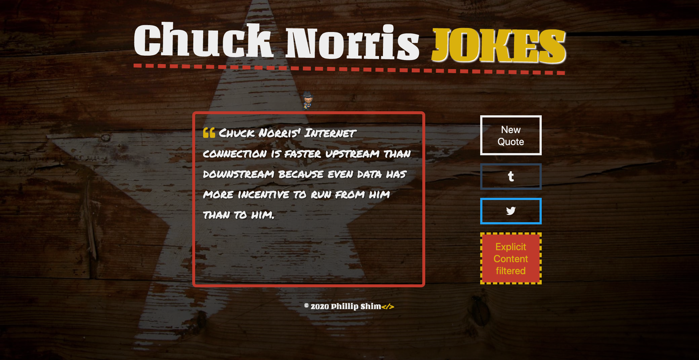

# Chuck Norris Says

Randomly fetchs a Chuck Norris joke

## Screenshots



## User stories

1. When the app loads, it automatically grabs a joke.
2. You can fetch a new quote by clicking on a button.
3. You can post displayed quote to SNS.
   - Post to Tumblr.
   - Post to Twitter.
4. You can optionally opt out to receive explicit content.

## Todo list

1. Add facebook share button.

## Tech stack

- react
- scss
- font-awesome
- react-typing-animation

## Running a local copy of the app

- Clone the repo

  ```bash
  git clone https://github.com/shimphillip/chuck-norris-says.git
  cd chuck-norris-says
  ```

- Install the dependencies

  ```bash
  yarn install
  ```

  `or`

  ```bash
  npm install
  ```

- Start a development server

  ```bash
  yarn start
  ```

  `or`

  ```bash
  npm start
  ```

- Build for production
  ```bash
  yarn build
  ```
  `or`
  ```bash
  npm run build
  ```

## Credits

- Proxy service by https://cors-anywhere.herokuapp.com/
- Backend API at http://www.icndb.com/api/
- GIF: Artwork "Dancing Chuck" by jesgrad07 at https://api.chucknorris.io/
- Background Photo: Glen Carrie @Unsplash https://unsplash.com/photos/dR77em3nyJY
- Favicon: https://dribbble.com/shots/3726127-Chuck-Norris by Gloria Sanduta
